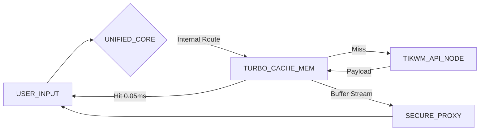

# PINGTOK CORE

> **UNIFIED HIGH-VELOCITY MEDIA RETRIEVAL UNIT**


---

## 📡 SYSTEM OVERVIEW

**PingTok** is a specialized extraction engine designed to bypass standard media restrictions on TikTok. It utilizes a **Unified Core Architecture**, merging a high-fidelity industrial interface with a robust serverless API. This monolith design ensures maximum stability and near-zero latency delivery across edge networks.

Developed under the **Industrial Light Protocol**, the system prioritizes speed, data integrity, and technical precision.

---

## 🏗️ ARCHITECTURE BLUEPRINT



---

## ⚡ KEY_CAPABILITIES

### **1. UNIFIED CORE DESIGN**
Seamless integration of frontend and backend within a single deployment unit, optimized for Vercel Serverless Functions.

### **2. TURBO CACHE MODULE**
Instant retrieval for frequently accessed media. Zero latency response for repeated requests within the cache window (1 Hour).

### **3. AUDIO FREQUENCY ANALYSIS**
Integrated `WaveSurfer` engine provides real-time visual analysis of audio tracks before extraction.

### **4. POLYGLOT INTERFACE**
Native support for **English (EN)** and **Bahasa Indonesia (ID)** with instant runtime switching via the HUD.

---

## 🚀 DEPLOYMENT PROTOCOLS

### OPTION A: LOCAL ENVIRONMENT

1.  **Clone Repository**
    ```bash
    git clone https://github.com/david-aistudio/PingTok.git
    cd PingTok
    ```

2.  **Install Dependencies**
    ```bash
    npm install
    ```

3.  **Initialize System**
    ```bash
    npm start
    ```
    Access uplink at: `http://localhost:3000`

### OPTION B: CLOUD DEPLOY (VERCEL)

PingTok is pre-configured for Vercel's Edge infrastructure.

1.  **Execute Deploy Command**
    ```bash
    vercel --prod
    ```

---

## 🔌 API_SPECIFICATIONS

**ENDPOINT:** `GET /api/tiktok/download`

| PARAMETER | TYPE | DESCRIPTION |
| :--- | :--- | :--- |
| `url` | `string` | Target TikTok video URL (Required) |

**PAYLOAD_SCHEMA:**
```json
{
  "status": "success",
  "platform": "tiktok",
  "cached": true,
  "title": "Video Description",
  "author": { "name": "User", "id": "id" },
  "downloads": [
    { "type": "video", "label": "HD No Watermark", "url": "..." }
  ]
}
```

---

## 👨‍💻 CREDITS

**ARCHITECT:** [David](https://github.com/david-aistudio)  
**AFFILIATION:** PINGTOK CORP  

> SECURE DATA PIPELINE // EST. 2025 // VERSION 2.1.4 stable

