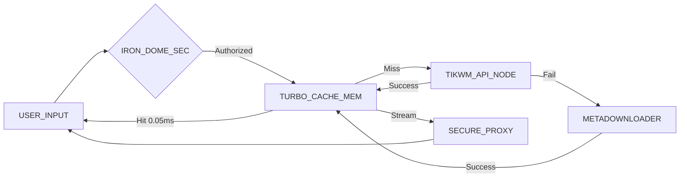

# PINGTOK CORE

> **HIGH-VELOCITY MEDIA RETRIEVAL UNIT**


---

## 📡 SYSTEM OVERVIEW

**PingTok** is a specialized, high-performance extraction engine designed to bypass standard media restrictions on TikTok. Unlike conventional downloaders, PingTok utilizes a **Dual-Engine Architecture** and **Turbo Cache Memory** to deliver payloads with near-zero latency.

Developed under the **Industrial Light Protocol**, the interface prioritizes speed, clarity, and technical precision.

---

## 🏗️ ARCHITECTURE BLUEPRINT



---

## ⚡ KEY CAPABILITIES

### **1. TURBO CACHE MODULE**
Instant retrieval for frequently accessed media. Zero latency response for repeated requests within the cache window (1 Hour).

### **2. IRON DOME SECURITY**
*   **Rate Limiting:** Automatic IP blocking (100 requests / 15 mins).
*   **Header Obfuscation:** Server identity masking via Helmet.
*   **SSRF Protection:** Secure proxy tunneling preventing internal network scans.

### **3. AUDIO FREQUENCY ANALYSIS**
Integrated `WaveSurfer` engine provides real-time visual analysis of audio tracks before extraction.

### **4. POLYGLOT INTERFACE**
Native support for **English (EN)** and **Bahasa Indonesia (ID)** with instant runtime switching.

---

## 🚀 DEPLOYMENT PROTOCOLS

### OPTION A: LOCAL ENVIRONMENT

1.  **Clone Repository**
    ```bash
    git clone https://github.com/david-aistudio/PingTok.git
    cd PingTok
    ```

2.  **Install Dependencies**
    ```bash
    npm install
    ```

3.  **Initialize System**
    ```bash
    npm start
    ```
    Access uplink at: `http://localhost:3000`

### OPTION B: CLOUD DEPLOY (VERCEL)

PingTok is optimized for serverless architecture.

1.  **Install Vercel CLI**
    ```bash
    npm i -g vercel
    ```

2.  **Execute Deploy Command**
    ```bash
    vercel --prod
    ```

---

## 🔌 API DOCUMENTATION

**ENDPOINT:** `GET /api/tiktok/download`

| PARAMETER | TYPE | DESCRIPTION |
| :--- | :--- | :--- |
| `url` | `string` | Target TikTok video URL (Required) |

**RESPONSE PAYLOAD:**
```json
{
  "status": "success",
  "platform": "tiktok",
  "cached": true,
  "title": "Video Description",
  "author": {
    "name": "User",
    "id": "user_id"
  },
  "downloads": [
    {
      "type": "video",
      "label": "HD No Watermark",
      "url": "https://..."
    }
  ]
}
```

---

## 👨‍💻 CREDITS

**ARCHITECT:** [David](https://github.com/david-aistudio)  
**AFFILIATION:** PINGTOK CORP  

> SECURE DATA PIPELINE // EST. 2025

